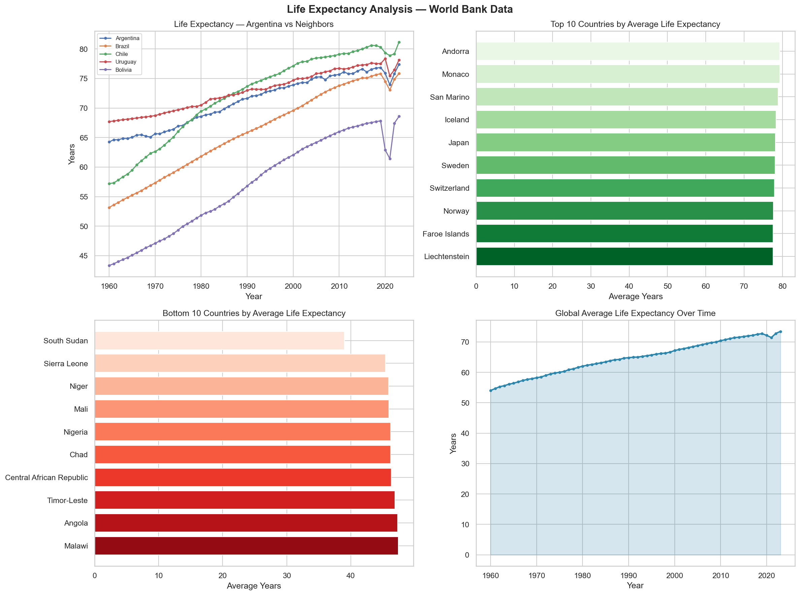

# Life Expectancy Analysis with pandas

Exploratory data analysis of global life expectancy trends using public World Bank data. 
Applies data cleaning, grouping, pivoting, and comparative analysis techniques with pandas, 
and data visualization with matplotlib and seaborn.

---

## Objectives
- Clean and structure real-world CSV data
- Analyze life expectancy trends over time by country
- Identify maximum, minimum, and differences across years and regions
- Prepare visualizations to support data-driven interpretation

---

## Dataset
- **Source:** World Bank — World Development Indicators
- **Indicator:** Life expectancy at birth, total (years) — SP.DYN.LE00.IN

---

## Visualizations

---

## Key Findings
- **Andorra and Monaco** lead global life expectancy averages
- **Malawi** registers the lowest average historically
- **Chile** consistently outperforms Argentina among neighbors
- Clear **global drop in 2020** reflecting COVID-19 impact
- Global average life expectancy rose from ~55 years (1960) to ~72 years (2020)

---

## Tools
- Python 3.13 · pandas · matplotlib · seaborn
- Data source: World Bank — World Development Indicators

---

## Author
María Paula Vera Morandini — Biochemist | Clinical Research & Health Data Analyst  
[LinkedIn](https://www.linkedin.com/in/maria-paula-vera-morandini-43b284399/) |
[Portfolio](https://mariapaulaveram.github.io/portfolio/)